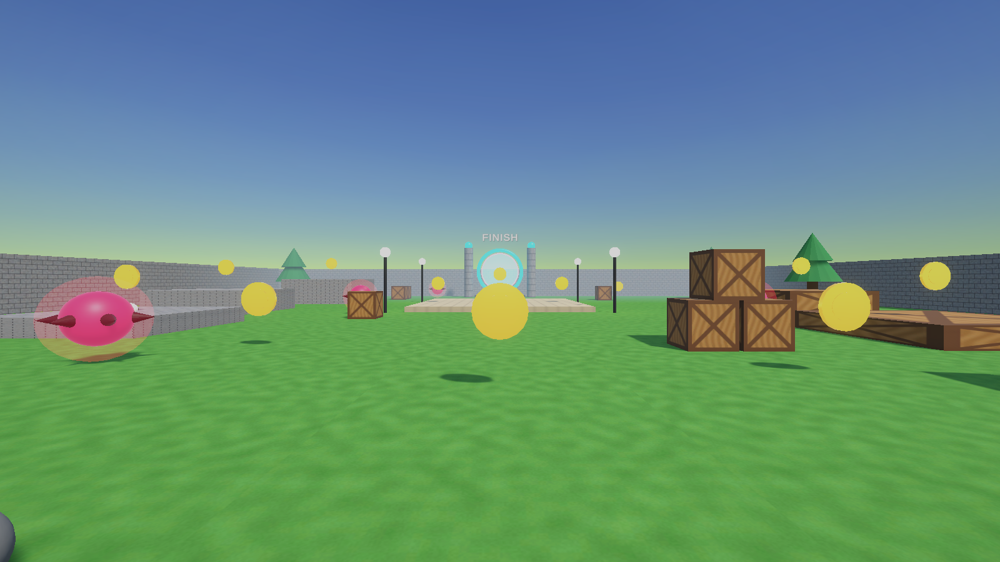
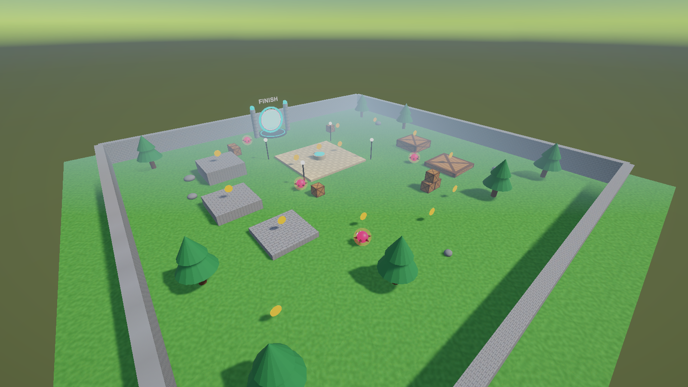

# Coin Rush 3D (Unity)

A first-person 3D mini-game made in Unity. Explore the arena, collect gold coins, avoid the spiky enemies and reach the glowing finish portal before time runs out.

## Features
- Walled arena with step platforms, crates, trees, lamp posts and a plaza fountain
- 14 spinning gold coins (+10 each) with particle bursts
- 4 enemies that patrol and chase when you get close (knockback + red screen flash)
- 3 health, 60-second timer, start / win / game over / time up screens
- Rotating finish portal with swirl particles, bloom glow and confetti
- PlayMode tests for coins, enemies, timer, portal and restart

## Controls
| Input | Action |
|---|---|
| W A S D / Arrows | Move |
| Mouse | Look |
| Space | Jump |
| Shift | Sprint |
| + / - | Walk speed |
| M | Mute |

## Open the project
1. Install **Unity 6000.4.0f1** (Unity 6) with Unity Hub.
2. Unity Hub -> **Add -> Add project from disk** -> select this folder.
3. Open `Assets/Scenes/CoinRush3D.unity` and press **Play**.

## Build
Menu **Coin Rush 3D -> Build Windows / Build WebGL**.

## Main scripts
`GameManager`, `PlayerController`, `Coin`, `EnemyController`, `Portal`, `UIManager`, `AudioManager` (in `Assets/Scripts`). The editor builder in `Assets/Scripts/Editor` generates the scene, materials and prefabs.

## Tests
Run **Window -> General -> Test Runner -> PlayMode -> Run All**.

Built with **Unity 6000.4.0f1**.
